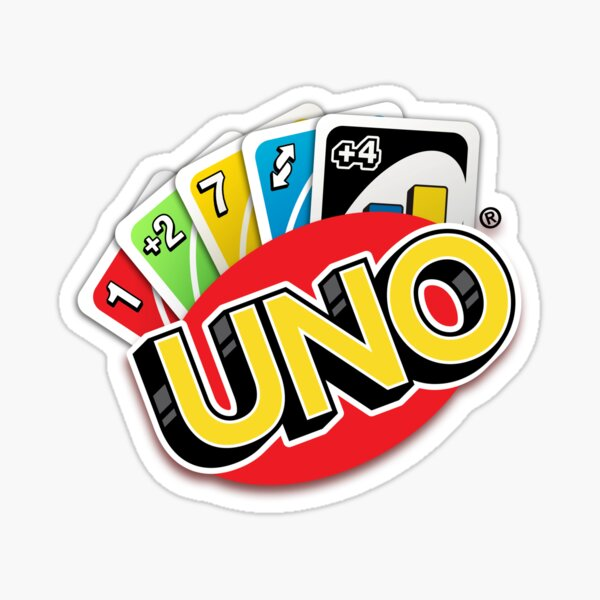

<!--
[![Contributors][contributors-shield]][contributors-url]
[![Forks][forks-shield]][forks-url]
[![Stargazers][stars-shield]][stars-url]
[![Issues][issues-shield]][issues-url]
-->

<!-- PROJECT LOGO -->
<br>
<div align="center">
	<a href="https://github.com/romainlancelot/uno">
		
	</a>
	<h2 align="center">Final project of C in 2A at ESGI (2022-2023)</h2>
	<hr>
	<a href="https://github.com/romainlancelot/uno/graphs/contributors">
		
	</a>
	<a href="https://github.com/romainlancelot/uno/graphs/stars">
		
	</a>
	<a href="https://github.com/romainlancelot/uno/graphs/forks">
		
	</a>
	<a href="https://github.com/romainlancelot/uno/issues">
		
	</a>
	<a href="https://github.com/romainlancelot/uno/pulls">
		
	</a>


  <p align="center">
	<a href="https://www.cprogramming.com/" target="_blank" rel="noreferrer">
		
  </a>
	<br>
	<a href="https://github.com/romainlancelot/uno">View Demo</a>
	·
	<a href="https://github.com/romainlancelot/uno/issues">Report Bug</a>
	·
	<a href="https://github.com/romainlancelot/uno/issues">Request Feature</a>
  </p>
</div>


<!-- ABOUT THE PROJECT -->
## About The Project

[![Product Name Screen Shot][product-screenshot]](https://github.com/romainlancelot/uno/blob/main/img/uno.jpg)

Demonstrate organizational skills and individual investment, clean code illustrating concepts seen in class, technical ability to implement features and present work.

We set ourselves the goal of recreating the game of uno in C.


<!-- GETTING STARTED -->
## Getting Started

### Prerequisites

To begin with you need to install something to compile a C program on your computer. Here is an example under Linux with the APT package manager.
* bash
  ```sh
  sudo apt install build-essential
  ```
* check install
  ```sh
  gcc --version
  ```
  The default version of GCC available in the Ubuntu 18.04 repositories is 7.4.0:
  ```sh
  # output
  gcc (Ubuntu 7.4.0-1ubuntu1~18.04) 7.4.0
  Copyright (C) 2017 Free Software Foundation, Inc.
  This is free software; see the source for copying conditions.  There is NO
  warranty; not even for MERCHANTABILITY or FITNESS FOR A PARTICULAR PURPOSE.
  ```
  ### Installation

1. Clone the repo
   ```sh
   git clone https://github.com/romainlancelot/uno.git
   ```
3. Compile the game
   ```sh
   cd src
   make
   ```
4. Run the game
   ```sh
   ./uno
   ```
5. Enjoy ! 😎


<!-- ROADMAP -->
## Roadmap

- [x] Create game assets:
	- [x 19 cards per color
	- [x] 8 cards "+2"
	- [x] 8 cards "Reverse"
	- [x] 8 cards "Skip"
	- [x] 4 cards "Joker"
	- [x] 4 cards "+4"
- [x] Random card distribution system according to the number of players.
- [x] Create a discard pile for used cards (which return in random order to the deck when the deck is empty).
- [x] Setting up the rules (colors on colors, numbers on numbers, special cards...).
- [ ] Graphical interface: SDL.
- [ ] Store scores (count the number of victories of each player) in a file.
- [x] Create a bot that can play (conditions) to play alone.
- [ ] Network the game (ability to connect multiple computers).
- [ ] BONUS: special modes (cards +20, the machines cards are multicolored...).


See the [open issues](https://github.com/romainlancelot/uno/issues) for a full list of proposed features (and known issues).


<!-- CONTACT -->
## Contact

Romain Lancelot - romain.h.lancelot@gmail.com

Project Link: [https://github.com/romainlancelot/uno](https://github.com/romainlancelot/uno)


<!-- MARKDOWN LINKS & IMAGES -->
<!-- https://www.markdownguide.org/basic-syntax/#reference-style-links -->
[contributors-shield]: https://img.shields.io/github/contributors/romainlancelot/uno.svg?style=for-the-badge
[contributors-url]: https://github.com/romainlancelot/uno/graphs/contributors
[forks-shield]: https://img.shields.io/github/forks/romainlancelot/uno.svg?style=for-the-badge
[forks-url]: https://github.com/romainlancelot/uno/network/members
[stars-shield]: https://img.shields.io/github/stars/romainlancelot/uno.svg?style=for-the-badge
[stars-url]: https://github.com/romainlancelot/uno/stargazers
[issues-shield]: https://img.shields.io/github/issues/romainlancelot/uno.svg?style=for-the-badge
[issues-url]: https://github.com/romainlancelot/uno/issues
[product-screenshot]: img/menu.jpg
